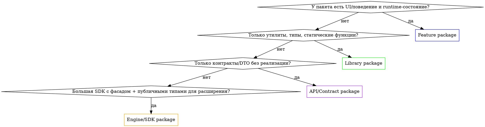

# SPM Package Design

Каждый Swift-пакет нужно проектировать осознанно. Универсального шаблона нет — есть **4 архетипа**, и под каждый свои правила публичности, инициализации и взаимодействия с host-приложением.

> **Related skills:**
> - `di-composition-root` — куда host-app встраивает пакет при сборке графа
> - `di-module-assembly` — Factory-паттерн внутри Feature-пакета и в host-app
> - `di-swinject` — если в host-app выбран Swinject как DI-framework (но **не** в самом пакете)

## Decision tree: какой это пакет?



## Универсальные правила (для всех типов)

1. **Никогда не импортируй DI-framework** в main target пакета — ни Swinject, ни Factory, ни Resolver, ни Needle, ни Cleanse. Это создаёт жёсткую связку: host обязан использовать тот же фреймворк той же мажорной версии.
   - **Исключение:** test target пакета может импортировать DI-framework для построения mock-графа в integration-тестах.
2. **Минимизируй `public`** — всё, что не нужно за пределами пакета, держим `internal`. Каждый `public` — это публичный контракт, который ломать нельзя без major version bump.
3. **Domain-пакеты не зависят от UIKit/SwiftUI/AppKit** — Models, Engine, бизнес-логика должны быть платформо-независимыми. UI-зависимости только в Feature-пакетах.
4. **Никаких глобальных синглтонов** в пакете — это превращает пакет в Service Locator и убивает testability.
5. **Тесты пакета — рядом с пакетом**, не в host-app. SPM сам поддерживает test target в `Package.swift`.

---

## 1. Feature package

**Что это:** Инкапсулирует целую UI-фичу (плеер, облачный браузер, чекаут) с собственным UI, поведением и runtime-состоянием.

**Примеры:** `vsdc-iOS-Player`, `vsdc-iOS-cloudBrowser`.

### Структура

```
MyFeature/
├── Sources/
│   └── MyFeature/
│       ├── Public/
│       │   ├── MyFeatureModule.swift           # public class — единственная точка входа
│       │   ├── MyFeatureDependencies.swift     # public struct — что нужно от host-а
│       │   └── MyFeatureOutput.swift           # public protocol — обратная связь к host-у
│       └── Internal/
│           ├── MyFeatureContainer.swift        # internal — ручная фабрика без DI-framework
│           ├── Assembly/
│           │   └── MyFeatureAssembly.swift     # internal — wires View+ViewModel
│           ├── View/
│           ├── ViewModel/
│           └── Services/
└── Tests/
    └── MyFeatureTests/
```

### Правила

1. **Один public Module-класс** — единственная runtime-точка входа. Всё остальное создаётся через него.
   ```swift
   public final class MyFeatureModule {
       public init(dependencies: MyFeatureDependencies)
       public func createMainScreen(output: MyFeatureOutput) -> UIViewController
   }
   ```
2. **Public `Dependencies` — struct, не protocol.** Struct даёт named-init без conformance gymnastics в host-е:
   ```swift
   public struct MyFeatureDependencies {
       public let userService: UserServiceAPI
       public let logger: LoggerAPI
       public init(userService: UserServiceAPI, logger: LoggerAPI) {
           self.userService = userService
           self.logger = logger
       }
   }
   ```
3. **Public `Output` — protocol.** Один protocol для всех обратных сигналов host-у (закрыть фичу, отправить событие, попросить навигацию).
4. **Внутренний Container — БЕЗ DI-framework.** Просто struct/class с `make...()` методами:
   ```swift
   final class MyFeatureContainer {
       let deps: MyFeatureDependencies
       init(deps: MyFeatureDependencies) { self.deps = deps }

       func makeMainViewModel() -> MainViewModel {
           MainViewModel(userService: deps.userService, helper: makeHelper())
       }
       private func makeHelper() -> Helper { Helper(logger: deps.logger) }
   }
   ```
5. **Все типы кроме Module/Dependencies/Output — `internal`.** Если host хочет использовать что-то напрямую — это либо API-контракт (вынести в API-пакет), либо плохая граница (Module не справляется со своей задачей фасада).

### Как host подключает Feature-пакет

См. `di-composition-root` — host-app в `AppDependencyContainer+MyFeature.swift` extension собирает `Dependencies` из своего DI-контейнера и создаёт `Module`:

```swift
extension AppDependencyContainer {
    func createMyFeatureModule() -> MyFeatureModule {
        let deps = MyFeatureDependencies(
            userService: swinjectContainer.resolve(UserServiceAPI.self)!,
            logger: swinjectContainer.resolve(LoggerAPI.self)!
        )
        return MyFeatureModule(dependencies: deps)
    }
}
```

Host знает о Swinject, пакет — нет.

---

## 2. Library package

**Что это:** Набор переиспользуемых типов, протоколов, утилит, статических функций. **Нет единой точки входа** и нет runtime-состояния (или оно изолировано в отдельных независимых типах).

**Примеры:** `vsdcEditorCommon` (рендер-слои, gesture strategies, log), `vsdcCommonServices`, `vsdcLogger`, `vsdcNetwork`.

### Структура

```
MyLibrary/
├── Sources/
│   └── MyLibrary/
│       ├── Models/                              # public — DTO, value types
│       │   ├── User.swift
│       │   └── Settings.swift
│       ├── Protocols/                           # public — контракты
│       │   └── LoggerAPI.swift
│       ├── Implementations/                     # public — конкретные реализации
│       │   └── ConsoleLogger.swift
│       ├── Utilities/                           # public — статические функции, extensions
│       │   └── String+Validation.swift
│       └── Internal/                            # internal — для своих нужд
│           └── Helpers/
└── Tests/
    └── MyLibraryTests/
```

### Правила

1. **НЕТ единой точки входа.** Любой публичный тип — независимая единица, которую host использует прямо.
2. **`public` — всё, что нужно извне.** Не пытайся «спрятать» библиотечные типы за фасадом — это анти-паттерн для library-пакета.
3. **Опциональный namespace-`enum`** для группировки констант или статических фабрик:
   ```swift
   public enum MyLibraryConstants {
       public static let defaultTimeout: TimeInterval = 30
   }
   public enum LoggerFactory {
       public static func make(level: LogLevel) -> LoggerAPI { ... }
   }
   ```
   Это **namespace**, не facade — он не владеет состоянием.
4. **Каждый публичный тип создаётся через свой init.** Никаких `Dependencies` структур и `Module`-фасадов.
5. **Stateless по умолчанию.** Если тип хранит состояние — host сам решает, как его шарить (singleton в host-DI или transient).

### Как host подключает Library-пакет

Просто импортирует и использует напрямую — в любом месте, где нужно:

```swift
import MyLibrary

let logger = ConsoleLogger(level: .debug)
let isValid = "test@example.com".isValidEmail  // extension из библиотеки
```

В `AppDependencyContainer` библиотечные типы регистрируются как обычные сервисы:

```swift
container.register(LoggerAPI.self) { _ in ConsoleLogger(level: .info) }
    .inObjectScope(.container)
```

---

## 3. API / Contract package

**Что это:** Чистые контракты — protocols, DTO, enums — **без реализации**. Используется для разрыва циклических зависимостей между пакетами.

**Примеры:** `vsdcCloudClientAPI` (интерфейсы для облачного клиента, реализация — в `vsdcCloudClient`).

### Структура

```
MyServiceAPI/
├── Sources/
│   └── MyServiceAPI/
│       ├── MyServiceAPI.swift           # public protocol — главный контракт
│       ├── DTOs/                         # public — структуры данных
│       │   ├── Request.swift
│       │   └── Response.swift
│       ├── Errors/                       # public — типизированные ошибки
│       │   └── MyServiceError.swift
│       └── Events/                       # public — публичные события
│           └── MyServiceEvent.swift
└── Tests/
    └── MyServiceAPITests/                # тесты структур данных, валидации DTO
```

### Правила

1. **Только public.** Никакого internal — пакет существует для других пакетов.
2. **Только структуры данных, протоколы и енумы.** Никаких классов с поведением, никаких моков, никаких реализаций.
3. **Не зависит ни от чего, кроме Foundation.** Если контракт зависит от UIKit/Combine/3rd-party — это уже не «чистый контракт», и переделать.
4. **Mutable state запрещён.** Никаких `var` в DTO без явной причины (struct с let-полями).
5. **Версионируется отдельно от реализации.** Это позволяет менять реализацию без bump major-версии API.

### Зачем нужен

- **Разрыв циклов:** `vsdcCloudClient` зависит от `vsdcNetwork`, `vsdcNetwork` хочет вызывать что-то облачное → оба зависят от `vsdcCloudClientAPI`, реализация не циклится.
- **Test doubles:** Mock-реализации в тестах живут в test-пакете, импортируют только API.
- **Подмена реализаций:** В разных средах (production / staging / dev) одна и та же API имеет разные конкретные реализации.

---

## 4. Engine / SDK package

**Что это:** Большая подсистема с **гибридным API** — фасад для основных операций + публичные типы для расширения/наблюдения.

**Примеры:** `vsdcMetalRenderEngine`, `vsdcStoreKit`.

### Структура

```
MyEngine/
├── Sources/
│   └── MyEngine/
│       ├── Public/
│       │   ├── MyEngine.swift                # public class — фасад
│       │   ├── MyEngineDependencies.swift    # public struct — внешние зависимости
│       │   ├── Configuration/                # public — настройки фасада
│       │   ├── Models/                       # public — типы для использования
│       │   ├── Protocols/                    # public — точки расширения
│       │   └── Events/                       # public — наблюдаемые события
│       └── Internal/
│           └── ...
└── Tests/
```

### Правила

1. **Один public Engine-класс** как главный фасад — для типичных сценариев использования.
2. **Public Models/Protocols** — для случаев, когда host хочет идти глубже фасада (расширить, отнаследоваться, подписаться).
3. **`Dependencies` опционально:** если Engine нужны внешние сервисы — да; если самодостаточен (Metal, StoreKit) — нет.
4. **Публичный API двухуровневый:**
   - Уровень 1 (фасад): `engine.render(frame:)`, `engine.purchase(product:)` — для 80% юзкейсов
   - Уровень 2 (типы): `RenderPass`, `PurchaseObserver` — для оставшихся 20% продвинутых сценариев
5. **Документируй разделение** в README пакета — host должен сразу видеть, какой уровень API использовать.

### Когда выбирать Engine, а не Feature

| Признак | Feature | Engine/SDK |
|---|---|---|
| Имеет UI | Да (целая фича) | Опционально (UI — на стороне host-а) |
| Закрытое поведение | Да (host не вмешивается) | Нет (host расширяет) |
| Несколько сценариев использования | Один main flow | Много вариантов |
| Стабильность API | Может меняться по бизнесу | Должен быть стабильным надолго |

---

## Cross-package dependencies

Граф зависимостей между пакетами должен быть **DAG** (направленный без циклов). Типовая иерархия в большом проекте:

```
                          [App]
                            ↓
                   ┌────────┴────────┐
                   ↓                 ↓
            [Feature pkgs]    [Engine pkgs]
                   ↓                 ↓
                   └────────┬────────┘
                            ↓
                    [Library pkgs]
                            ↓
                     [API/Contract pkgs]
                            ↓
                       [Foundation]
```

Правила направления:
- **App** может зависеть от всех типов
- **Feature** может зависеть от Library, API, Engine — но **не от других Feature** (используй API-контракт для связи)
- **Engine** может зависеть от Library, API — не от Feature, не от других Engine (циклы)
- **Library** может зависеть только от API и Foundation
- **API** не зависит ни от чего, кроме Foundation

Если нужна связь Feature↔Feature — выноси контракт в API-пакет, обе фичи зависят от API.

## Common Mistakes

1. **Один Module-фасад в library-пакете** — заставляет host тащить через 5 уровней вложенности то, что должно быть прямым импортом.
2. **DI-framework в `Package.swift`** — самая частая ошибка. См. универсальное правило 1.
3. **UIKit в Domain/Library пакете** — не даст переиспользовать пакет в macOS app или CLI.
4. **`public` без причины** — каждый лишний public — это публичный контракт, который придётся поддерживать.
5. **Реализация и API в одном пакете, когда нужны циклы** — выноси API в отдельный пакет.
6. **`@_exported import`** — анти-паттерн, прячет реальные зависимости host-а от его dependency manager.
7. **Test-helpers в main target** — добавляются в production binary. Выноси в отдельный test-utility пакет (`MyLibraryTestUtils`) или в `Tests/MyLibraryTests/Support/`.

## Quick checklist при создании нового пакета

- [ ] Определён архетип (Feature / Library / API / Engine)
- [ ] `Package.swift` не зависит ни от одного DI-framework
- [ ] Минимизирован public surface
- [ ] Domain/Models не зависят от UIKit/SwiftUI
- [ ] Нет глобальных синглтонов
- [ ] Test target присутствует в `Package.swift`
- [ ] README объясняет архетип и точку входа
- [ ] Зависимости от других пакетов формируют DAG (без циклов)
