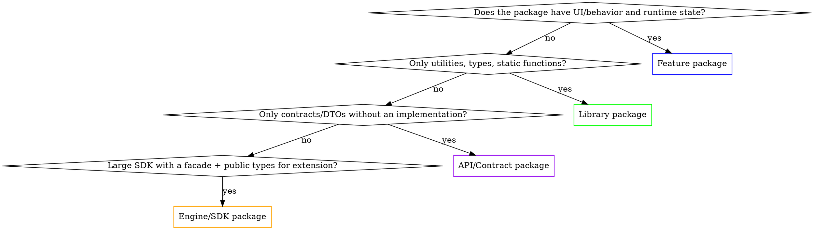

# SPM Package Design

Every Swift package needs to be designed deliberately. There is no universal template — there are **4 archetypes**, and each has its own rules for visibility, initialization, and how it talks to the host application.

> **Related skills:**
> - `di-composition-root` — where the host app plugs the package into when wiring its graph
> - `di-module-assembly` — Factory pattern inside a Feature package and inside the host app
> - `di-swinject` — if Swinject is the chosen DI framework in the host app (but **not** inside the package itself)
> - `di-factory` — if Factory (hmlongco) is the chosen DI framework in the host app. The "do not import a DI framework in a package" rule applies to Factory too; modular `extension Container` per feature lives in the **app target**, see the `di-factory` "Modular Containers" section

## Decision tree: which kind of package is this?



## Universal rules (for all types)

1. **Never import a DI framework** in the main target of a package — neither Swinject, nor Factory (FactoryKit), nor Resolver, nor Needle, nor Cleanse. It creates a hard coupling: the host is forced to use the same framework at the same major version.
   - **Exception:** the package's test target may import a DI framework to build a mock graph for integration tests.
   - **About Factory specifically:** even though its `extension Container` pattern looks attractive for modular organization, putting `import FactoryKit` into an SPM package is the same rule violation as Swinject. Modular `extension Container { var foo: Factory<Foo> }` per feature lives in the **app target** (e.g. files like `Container+ProfileFeature.swift`, `Container+SettingsFeature.swift`), not in SPM packages. See `di-factory`, "Modular Containers" section.
2. **Minimize `public`** — anything not needed outside the package stays `internal`. Every `public` is a public contract that can't be broken without a major version bump.
3. **Domain packages don't depend on UIKit/SwiftUI/AppKit** — Models, Engine, business logic must be platform-independent. UI dependencies belong only in Feature packages.
4. **No global singletons** in the package — that turns the package into a Service Locator and destroys testability.
5. **Package tests live next to the package**, not in the host app. SPM supports test targets directly in `Package.swift`.

---

## 1. Feature package

**What it is:** Encapsulates a whole UI feature (player, cloud browser, checkout) with its own UI, behavior, and runtime state.

**Examples:** `vsdc-iOS-Player`, `vsdc-iOS-cloudBrowser`.

### Structure

```
MyFeature/
├── Sources/
│   └── MyFeature/
│       ├── Public/
│       │   ├── MyFeatureModule.swift           # public class — the single entry point
│       │   ├── MyFeatureDependencies.swift     # public struct — what's needed from the host
│       │   └── MyFeatureOutput.swift           # public protocol — feedback to the host
│       └── Internal/
│           ├── MyFeatureContainer.swift        # internal — manual factory without a DI framework
│           ├── Assembly/
│           │   └── MyFeatureAssembly.swift     # internal — wires View+ViewModel
│           ├── View/
│           ├── ViewModel/
│           └── Services/
└── Tests/
    └── MyFeatureTests/
```

### Rules

1. **One public Module class** — the only runtime entry point. Everything else is created through it.
   ```swift
   public final class MyFeatureModule {
       public init(dependencies: MyFeatureDependencies)
       public func createMainScreen(output: MyFeatureOutput) -> UIViewController
   }
   ```
2. **Public `Dependencies` — a struct, not a protocol.** A struct gives you a named init without conformance gymnastics on the host side:
   ```swift
   public struct MyFeatureDependencies {
       public let userService: UserServiceAPI
       public let logger: LoggerAPI
       public init(userService: UserServiceAPI, logger: LoggerAPI) {
           self.userService = userService
           self.logger = logger
       }
   }
   ```
3. **Public `Output` — a protocol.** A single protocol for all feedback signals to the host (close the feature, send an event, ask for navigation).
4. **Internal Container — WITHOUT a DI framework.** Just a struct/class with `make...()` methods:
   ```swift
   final class MyFeatureContainer {
       let deps: MyFeatureDependencies
       init(deps: MyFeatureDependencies) { self.deps = deps }

       func makeMainViewModel() -> MainViewModel {
           MainViewModel(userService: deps.userService, helper: makeHelper())
       }
       private func makeHelper() -> Helper { Helper(logger: deps.logger) }
   }
   ```
5. **All types except Module/Dependencies/Output are `internal`.** If the host wants to use something directly — that's either an API contract (move it into an API package) or a bad boundary (the Module isn't doing its facade job).

### How the host integrates a Feature package

See `di-composition-root` — in `AppDependencyContainer+MyFeature.swift` extension the host app builds `Dependencies` from its DI container and creates the `Module`:

```swift
extension AppDependencyContainer {
    func createMyFeatureModule() -> MyFeatureModule {
        let deps = MyFeatureDependencies(
            userService: swinjectContainer.resolve(UserServiceAPI.self)!,
            logger: swinjectContainer.resolve(LoggerAPI.self)!
        )
        return MyFeatureModule(dependencies: deps)
    }
}
```

The host knows about Swinject; the package does not.

---

## 2. Library package

**What it is:** A collection of reusable types, protocols, utilities, and static functions. **No single entry point** and no runtime state (or it's isolated inside separate, independent types).

**Examples:** `vsdcEditorCommon` (render layers, gesture strategies, log), `vsdcCommonServices`, `vsdcLogger`, `vsdcNetwork`.

### Structure

```
MyLibrary/
├── Sources/
│   └── MyLibrary/
│       ├── Models/                              # public — DTOs, value types
│       │   ├── User.swift
│       │   └── Settings.swift
│       ├── Protocols/                           # public — contracts
│       │   └── LoggerAPI.swift
│       ├── Implementations/                     # public — concrete implementations
│       │   └── ConsoleLogger.swift
│       ├── Utilities/                           # public — static functions, extensions
│       │   └── String+Validation.swift
│       └── Internal/                            # internal — for the package's own needs
│           └── Helpers/
└── Tests/
    └── MyLibraryTests/
```

### Rules

1. **NO single entry point.** Any public type is an independent unit the host uses directly.
2. **`public` — anything that needs to be available externally.** Don't try to "hide" library types behind a facade — that's an anti-pattern for a Library package.
3. **Optional namespace `enum`** for grouping constants or static factories:
   ```swift
   public enum MyLibraryConstants {
       public static let defaultTimeout: TimeInterval = 30
   }
   public enum LoggerFactory {
       public static func make(level: LogLevel) -> LoggerAPI { ... }
   }
   ```
   This is a **namespace**, not a facade — it owns no state.
4. **Each public type is created via its own init.** No `Dependencies` structs, no `Module` facades.
5. **Stateless by default.** If a type holds state — the host decides how to share it (singleton in the host DI or transient).

### How the host integrates a Library package

It just imports and uses things directly — wherever needed:

```swift
import MyLibrary

let logger = ConsoleLogger(level: .debug)
let isValid = "test@example.com".isValidEmail  // extension from the library
```

In `AppDependencyContainer`, library types are registered as ordinary services:

```swift
container.register(LoggerAPI.self) { _ in ConsoleLogger(level: .info) }
    .inObjectScope(.container)
```

---

## 3. API / Contract package

**What it is:** Pure contracts — protocols, DTOs, enums — **without implementation**. Used to break cyclic dependencies between packages.

**Examples:** `vsdcCloudClientAPI` (interfaces for the cloud client; implementation in `vsdcCloudClient`).

### Structure

```
MyServiceAPI/
├── Sources/
│   └── MyServiceAPI/
│       ├── MyServiceAPI.swift           # public protocol — main contract
│       ├── DTOs/                         # public — data structures
│       │   ├── Request.swift
│       │   └── Response.swift
│       ├── Errors/                       # public — typed errors
│       │   └── MyServiceError.swift
│       └── Events/                       # public — public events
│           └── MyServiceEvent.swift
└── Tests/
    └── MyServiceAPITests/                # tests of data structures, DTO validation
```

### Rules

1. **Public only.** No internal — the package exists for other packages.
2. **Only data structures, protocols, and enums.** No classes with behavior, no mocks, no implementations.
3. **Depends on nothing but Foundation.** If the contract depends on UIKit/Combine/3rd-party — it's no longer a "pure contract"; rework it.
4. **Mutable state is forbidden.** No `var` in DTOs without a clear reason (struct with `let` fields).
5. **Versioned independently of the implementation.** This lets you change implementation without bumping the major version of the API.

### Why it exists

- **Cycle breaking:** `vsdcCloudClient` depends on `vsdcNetwork`, `vsdcNetwork` wants to invoke something cloud-related → both depend on `vsdcCloudClientAPI`, the implementation no longer cycles.
- **Test doubles:** Mock implementations in tests live in a test package and import only the API.
- **Implementation swapping:** In different environments (production / staging / dev) the same API has different concrete implementations.

---

## 4. Engine / SDK package

**What it is:** A large subsystem with a **hybrid API** — a facade for primary operations + public types for extension/observation.

**Examples:** `vsdcMetalRenderEngine`, `vsdcStoreKit`.

### Structure

```
MyEngine/
├── Sources/
│   └── MyEngine/
│       ├── Public/
│       │   ├── MyEngine.swift                # public class — facade
│       │   ├── MyEngineDependencies.swift    # public struct — external dependencies
│       │   ├── Configuration/                # public — facade settings
│       │   ├── Models/                       # public — types to be consumed
│       │   ├── Protocols/                    # public — extension points
│       │   └── Events/                       # public — observable events
│       └── Internal/
│           └── ...
└── Tests/
```

### Rules

1. **One public Engine class** as the main facade — for typical usage scenarios.
2. **Public Models/Protocols** — for cases where the host wants to go deeper than the facade (extend, subclass, subscribe).
3. **`Dependencies` is optional:** if the Engine needs external services — yes; if it's self-contained (Metal, StoreKit) — no.
4. **The public API is two-tiered:**
   - Tier 1 (facade): `engine.render(frame:)`, `engine.purchase(product:)` — for 80% of use cases
   - Tier 2 (types): `RenderPass`, `PurchaseObserver` — for the remaining 20% advanced scenarios
5. **Document the split** in the package README — the host should see immediately which API tier to use.

### When to pick Engine, not Feature

| Trait | Feature | Engine/SDK |
|---|---|---|
| Has UI | Yes (a whole feature) | Optional (UI lives on the host side) |
| Closed behavior | Yes (host doesn't intrude) | No (host extends it) |
| Multiple usage scenarios | One main flow | Many variants |
| API stability | May change with the business | Must be stable for a long time |

---

## Cross-package dependencies

The dependency graph between packages must be a **DAG** (directed, acyclic). Typical hierarchy in a large project:

```
                          [App]
                            ↓
                   ┌────────┴────────┐
                   ↓                 ↓
            [Feature pkgs]    [Engine pkgs]
                   ↓                 ↓
                   └────────┬────────┘
                            ↓
                    [Library pkgs]
                            ↓
                     [API/Contract pkgs]
                            ↓
                       [Foundation]
```

Direction rules:
- **App** can depend on all types
- **Feature** can depend on Library, API, Engine — but **not on other Features** (use an API contract to connect them)
- **Engine** can depend on Library, API — not on Features, not on other Engines (cycles)
- **Library** can only depend on API and Foundation
- **API** depends on nothing but Foundation

If a Feature↔Feature link is needed — extract the contract into an API package, both features depend on the API.

## Common Mistakes

1. **A single Module facade in a library package** — forces the host to drag things through five layers of nesting that should be a direct import.
2. **A DI framework in `Package.swift`** — the most frequent mistake. See universal rule 1.
3. **UIKit in a Domain/Library package** — won't let you reuse the package in a macOS app or CLI.
4. **`public` without a reason** — every extra public is a public contract you'll have to support.
5. **Implementation and API in one package when you need cycles** — extract the API into a separate package.
6. **`@_exported import`** — anti-pattern; hides the host's real dependencies from its dependency manager.
7. **Test helpers in the main target** — they get added to the production binary. Move them into a separate test-utility package (`MyLibraryTestUtils`) or into `Tests/MyLibraryTests/Support/`.

## Quick checklist when creating a new package

- [ ] Archetype is identified (Feature / Library / API / Engine)
- [ ] `Package.swift` does not depend on any DI framework
- [ ] Public surface is minimized
- [ ] Domain/Models don't depend on UIKit/SwiftUI
- [ ] No global singletons
- [ ] Test target is present in `Package.swift`
- [ ] README explains the archetype and the entry point
- [ ] Dependencies on other packages form a DAG (no cycles)
